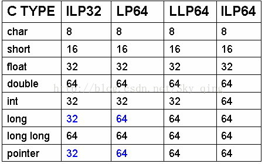

## bug1

/mockcpp/include/mockcpp/PageAllocator.h:37:25: error: cast from ‘void*’ to ‘int’ loses precision [-fpermissive]
   return (void *)(((int)addr) & ~(pageSize() - 1));

修改：
	win32	win64	linux32	linux64
int 	4	4	4	4
long	4	4	4	8

  
